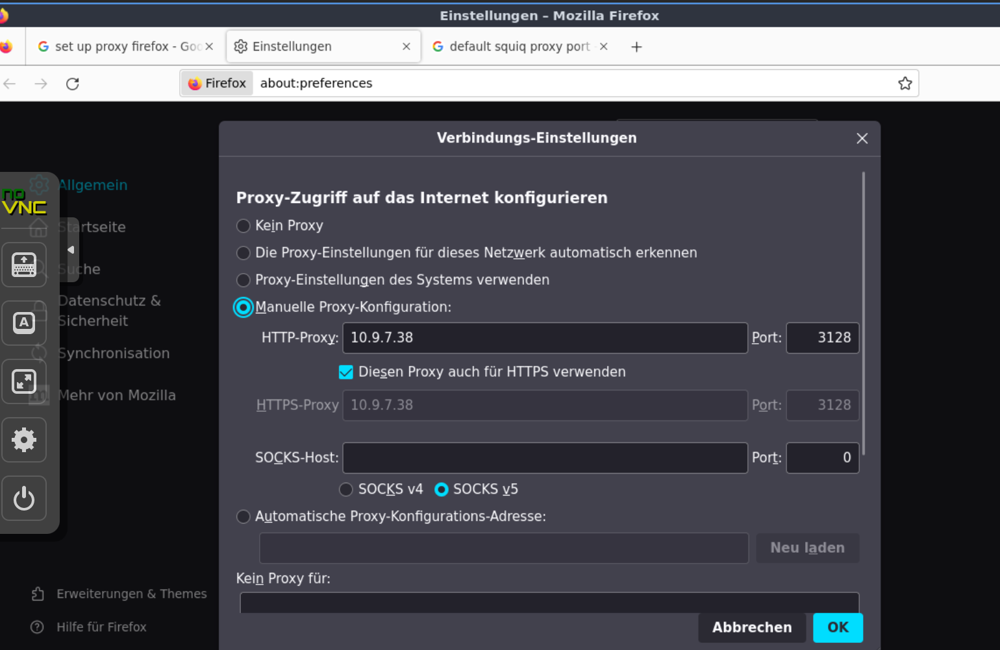
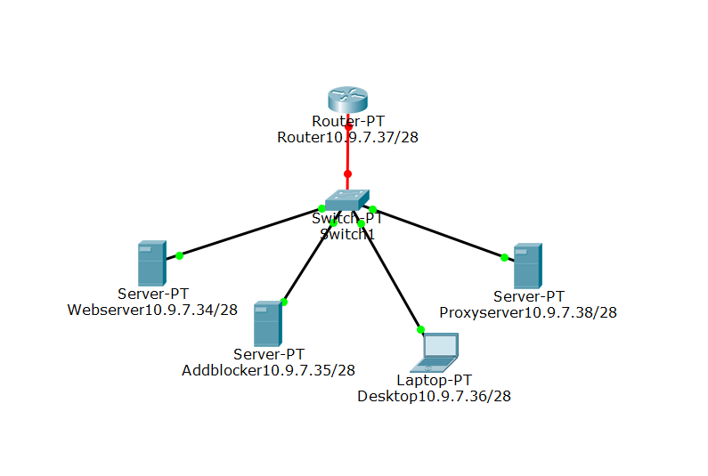

= Dokumentation Netzwerktechnik Projekt
Stevan Vlajic, Moritz Wagner
:description: Dokumentation NWT-Projekt
:sectanchors:
:sectnums:
:icons: font
:experimental:
:sectnums:
:toc:
:doctype: book
:url-repo: https://github.com/Stevan06v/VLAJIC-WAGNER-NWT-DOCS.git

* Team:
** Stevan Vlajic
** Moritz Wagner

* Stand der Dinge:
** Die Basic Task ist fertig
** Die Extended Task fertig

Grundsätzlich haben alle Benutzer dasselbe Passwort:

User:

* username: stevan oder moritz
* Passwort: Stevan2006 oder Moritz2006

oder

Root User:

* username: root
* Passwort: FA8622-3a1b

== Webserver

* Name: 3ahitm-vlajic-wagner-webserver

Wieso Apache?

* "Easy to use" und einfach zu installieren

=== Config
* Gateway: *10.9.7.37*
* IPv4: *10.9.7.34/28*
* DNS: *10.9.7.35*
* Brigde: *vmbr 7*

=== Setup
Verwendete Software: Apache2
Verwendetes OS: Ubuntu lts

* Commands:
** `sudo useradd stevan`
** sudo usermod -aG sudo stevan
*** password: FA8622-3a1b
** `sudo apt-get update && sudo apt full-upgrade -y`
** `sudo apt-get install apache2 -y`
** `cd /var/www/html/ && git clone https://github.com/Stevan06v/TicTacToe.git`
** `mv ./TicTacToe/* ./`

Webserver unter 10.9.7.34 erreichbar.

== AdBlocker

* Name: 3ahitm-vlajic-wagner-adblocker

*Wieso PiHole:*

* "Easy to use" & leichte installation
* Klein und "kompakt" im Vergleich zu AdGuard
* Eigene gute Erfahrungen mit PiHole gemacht

=== Config
* Gateway: *10.9.7.37*
* IPv4: *10.9.7.35/28*
* DNS: *10.9.7.35*
* Brigde: *vmbr 7*

=== Setup
Verwendete Software: PiHole
Verwendetes OS: Ubuntu lts

* Commands:
** `sudo useradd stevan`
** sudo usermod -aG sudo stevan
*** password: FA8622-3a1b
** `sudo apt-get update && sudo apt full-upgrade -y`
** `curl -sSL https://install.pi-hole.net | bash`

PiHole unter 10.9.7.35 erreichbar.

== Router

* Name: 3ahitm-vlajic-wagner-router

=== Config
* net0:
** Name: GNET
** Gateway: *10.9.7.254*
** IPv4: *10.9.7.251/28*
** Brigde: *vmbr 7*
* net1:
** Name: eth0
** IPv4: *10.9.7.37/28*
** Brigde: *vmbr 7*

== Proxyserver

* Name: 3ahitm-vlajic-wagner-proxyserver

Wieso SQUID?

* "Easy to use" und einfach zu installieren

=== Config
* Gateway: *10.9.7.37*
* IPv4: *10.9.7.38/28*
* DNS: *10.9.7.35*
* Brigde: *vmbr 7*

=== Setup
Verwendete Software: Apache2
Verwendetes OS: Ubuntu lts

* Commands:
** `sudo useradd stevan`
** sudo usermod -aG sudo stevan
*** password: FA8622-3a1b
** `sudo apt-get update && sudo apt full-upgrade -y`
** `sudo apt-get install apache2 -y`
** `sudo apt-get install squid`
** `sudo nano /etc/squid/squid.conf`
*** `http_port 3128`
*** `http_access allow all`
*** `cache_dir ufs /var/spool/squid 100 16 256`
** `sudo systemctl restart squid`

Proxyserver unter 10.9.7.38 erreichbar.

=== Bilder

== Desktop VM
* Name: 3ahitm-vlajic-wagner-desktopvm
* VM-ID: 7231
* Sprache (Keyboard Layout): German
* Vor/Nachname: Stevan
* Passwort: Stevan2006

=== Remote Desktop
* `sudo apt-get install lxde`
* `sudo apt-get install xrdp`
* `sudo systemctl enable xrdp`
* `sudo systemctl start xrdp`

=== Settings
* IP: 10.9.7.33
* Netmask: /28
* DNS: 10.9.7.35
* Gateway: 10.9.7.37
* OS-Type: 6.x - 2.6 Kernel

== Netzwerkplan

== FCAPS
* Performance Management
** Zusätzlicher Uptime Robot Webserver für Performance Management
** Checkt ob Services Online sind
** Gibt die Latenz aus
** Gibt den derzeitigen PING der Webseite an
** Gibt an wie lange die Services schon laufen

* Configuration Management
** Tägliche Backups von den Daten
** Monatliche Backups von den Configurations Dateien

* Fault Management
** Backups von Fehler Log-Files
** Ursprung des Fehlers festlegen
** Kontinuierliche Updates der einzelnen System Softwares
** Automatische Benachrichtigung bei Fehlern

* Security Management
** Firewall einrichten, um Zugang zum Netzwerk einzuschränken
** Monitoring Software einsetzen wie zum Beispiel:
*** Nagios
*** ZABBIX
*** CHeckMK
** um Fehler schnell feststellen zu können und die Sicherheit zu jeder Zeit gewährleisten zu können

* Accounting Management
** Netzwerk Protokollieren von Netzwerk Aktivitäten um ungewünschten Daten Verkehr einzuschränken
** Quota Systeme implementieren um die Nutzung von Netzwerkressourcen leicht begrenzen zu können
** Regelmäßige Analyse des Netzwerktraffics um die Effizient zu verbessern

